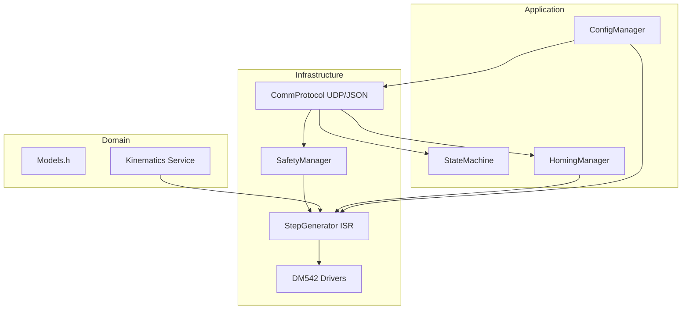

# Contrôleur CNC 5-Axes (Trunnion) - ESP32

> Firmware hautes performances pour contrôleur CNC 5-axes (X, Y, Z, A, C) basé sur ESP32.  
> Topologie **Table-Table Trunnion** avec support **RTCP (G43.4)**.

## 🏗️ Clean Architecture

Le projet est structuré selon les principes de la **Clean Architecture** pour garantir la séparation des préoccupations et la testabilité :



### Couches :
1. **Domain** : Logique métier pure (Mathématiques de la cinématique inverse). Indépendant du runtime.
2. **Application** : Cas d'utilisation (Séquence de Homing, gestion d'états, persistance LittleFS).
3. **Infrastructure** : Adaptateurs matériels (Génération d'impulsions par Timer, Communication UDP, Sécurité GPIO).

## 🚀 Fonctionnalités

### Noyau Temps Réel
- **Cinématique RTCP (G43.4)** : Compensation automatique des rotations A et C.
- **Dual-Core FreeRTOS** : Core 0 pour les communications, Core 1 pour le mouvement temps réel.
- **Pulse Generator (33kHz)** : Génération synchrone 5-axes via Hardware Timer, rampe pré-calculée (zéro float dans l'ISR).
- **Rampes d'Accélération** : Profils trapézoïdaux (500mm/s²) avec pré-calcul et lookup table.

### Sécurité Industrielle
- **Arrêt d'Urgence** : ISR matériel immédiat + désactivation drivers.
- **Fins de Course NF** : 5 capteurs avec debouncing logiciel (3 lectures).
- **Soft Limits** : Limites logicielles configurables par axe.
- **Watchdog** : Task Watchdog ESP-IDF (10s timeout).

### Communication
- **WiFi AP** : Point d'accès `CNC_5A_WIFI` configurable.
- **9 Commandes** : `move`, `jog`, `home`, `reset`, `stop`, `pause`, `resume`, `status`, `config`.
- **Position Temps Réel** : Feedback 5 Hz de la position des 5 axes.
- **Configuration Persistante** : Paramètres machine stockés en JSON sur LittleFS.

### Homing Professionnel
- Séquence Z→X→Y→A→C avec sécurité anti-collision.
- 3 phases : approche rapide, back-off, réapproche lente.
- Timeout 30s par axe avec gestion d'erreur.

## 🔌 Mapping GPIO (Cible PCB Chapitre 3)
| Axe | Step | Dir | Limit | Driver |
|:---:|:---:|:---:|:---:|:---:|
| X | 12 | 14 | 34 (NF) | DM542 |
| Y | 27 | 26 | 35 (NF) | DM542 |
| Z | 25 | 33 | 36 (NF) | DM542 |
| A | 32 | 4  | 18 (NF) | DM542 |
| C | 2  | 15 | 19 (NF) | DM542 |
| **E-STOP** | - | - | 39 (PD) | - |
| **ENABLE** | - | - | 5 (ALL) | - |

## 📁 Structure du Projet
```
CNC5AIXIS/
├── src/
│   ├── main.cpp               # Point d'entrée, FreeRTOS tasks
│   ├── main.h                 # Globaux (Queue, constantes)
│   ├── domain/
│   │   ├── Models.h           # Structures de données
│   │   └── Kinematics.h       # Cinématique inverse RTCP
│   ├── application/
│   │   ├── StateMachine.h/cpp # Machine d'état thread-safe
│   │   ├── ConfigManager.h/cpp# Persistance LittleFS
│   │   └── HomingManager.h/cpp# Séquence de homing
│   └── infrastructure/
│       ├── CommProtocol.h/cpp  # Serveur UDP/JSON
│       ├── SafetyManager.h/cpp # E-STOP + Limits + Soft Limits
│       ├── StepGenerator.h/cpp # Pulse generator + rampes
│       └── drivers/
│           ├── IDriver.h       # Interface abstraite
│           └── DM542Driver.h   # Implémentation DM542
├── docs/
│   ├── kinematics.md          # Doc cinématique RTCP
│   ├── security.md            # Doc sécurité & homing
│   └── protocol.md            # Protocole UDP/JSON complet
├── test_comm.py               # Client de test Python (interactif)
├── platformio.ini             # Configuration PlatformIO
└── README.md
```

## 🛠️ Installation
1. Installer **PlatformIO** sur VS Code.
2. Ouvrir le dossier racine.
3. `pio run` pour compiler.
4. `pio run --target upload` pour téléverser sur l'ESP32.
5. Le contrôleur crée un point d'accès Wi-Fi `CNC_5A_WIFI`.

## 🧪 Test
```bash
# Se connecter au WiFi CNC_5A_WIFI (mot de passe: 12345678)

# Mode interactif
python test_comm.py

# Mode automatique
python test_comm.py --auto
```

## 📖 Documentation
- [Cinématique RTCP](docs/kinematics.md)
- [Sécurité & Homing](docs/security.md)
- [Protocole UDP/JSON](docs/protocol.md)
